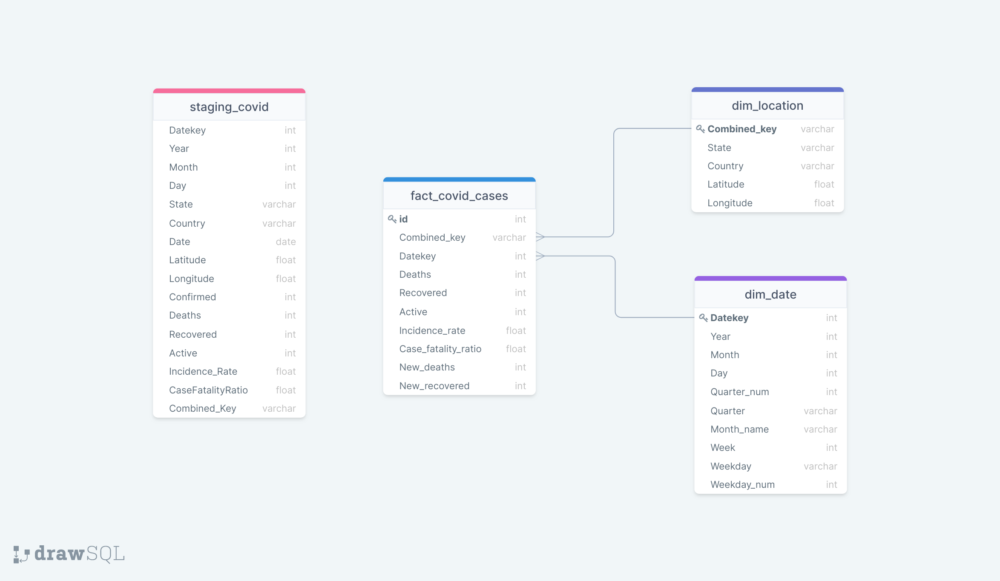
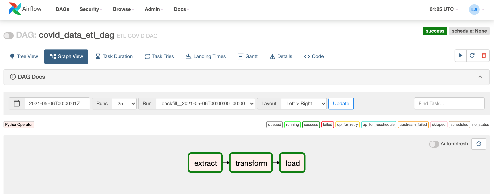
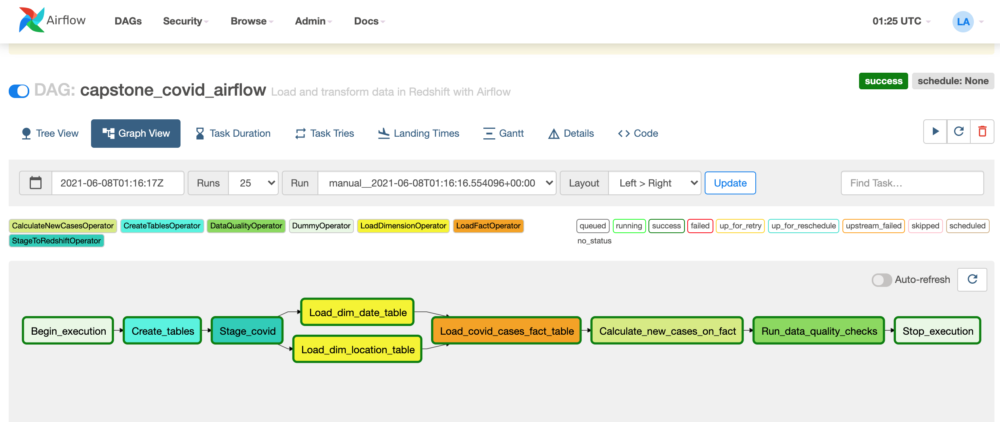

# Udacity Data Engineer Capstone Project

## Goal of the project
The purpose of this project is to build an ETL pipeline that will be able to provide information to data analysts, researchers and the general public with COVID-19  statistics for different cities, states/provinces, and countries across the world. It extracts all information from John Hopkins University dataset, and using Apache Spark, it performs several transformations on it and persists the data into csv files into a S3 bucket, that later will be loaded to a Redshift database. 
The csv files get migrated to s3, then the data gets uploaded to Redshift, undergoes further transformation and gets loaded to normalized fact and dimension tables using a series of reusable tasks that allow for easy backfills. Then, using Redshift, some calculations are performed to identify the difference between the number of cases over the days.
Finally, data checks are run against the data in the fact and dimension tables so as to catch any discrepancies that might be found in the data.##

## Use Cases
### End Use Cases
Considerando que o numero de casos durante a pandemia varia de forma diferente em cada pais, o objetivo inicial e criar  analitic tables para futura analise e desenvolvimento de deshboards.##

## Dataset

### John Hopkins University Dataset 
Global COVID-19 cases data files are daily updated from John Hopkins Institute at github [JHU Github](https://github.com/CSSEGISandData/COVID-19/tree/master/csse_covid_19_data/csse_covid_19_daily_reports).

This dataset tracks confirmed, deaths, and recovered COVID-19 cases in provinces, states, and countries across the world with a breakdown to the county level in the US.

### [Daily reports (csse_covid_19_daily_reports)](https://github.com/CSSEGISandData/COVID-19/tree/master/csse_covid_19_data/csse_covid_19_daily_reports)

This folder contains daily case reports. All timestamps are in UTC (GMT+0).

#### File naming convention
MM-DD-YYYY.csv in UTC.

#### Field description
* <b>FIPS</b>: US only. Federal Information Processing Standards code that uniquely identifies counties within the USA.
* <b>Admin2</b>: County name. US only.
* <b>Province_State</b>: Province, state or dependency name.
* <b>Country_Region</b>: Country, region or sovereignty name. The names of locations included on the Website correspond with the official designations used by the U.S. Department of State.
* <b>Last Update</b>: MM/DD/YYYY HH:mm:ss  (24 hour format, in UTC).
* <b>Lat</b> and <b>Long_</b>: Dot locations on the dashboard. All points (except for Australia) shown on the map are based on geographic centroids, and are not representative of a specific address, building or any location at a spatial scale finer than a province/state. Australian dots are located at the centroid of the largest city in each state.
* <b>Confirmed</b>: Counts include confirmed and probable (where reported).
* <b>Deaths</b>: Counts include confirmed and probable (where reported).
* <b>Recovered</b>: Recovered cases are estimates based on local media reports, and state and local reporting when available, and therefore may be substantially lower than the true number. US state-level recovered cases are from [COVID Tracking Project](https://covidtracking.com/).
* <b>Active:</b> Active cases = total cases - total recovered - total deaths.
* <b>Incident_Rate</b>: Incidence Rate = cases per 100,000 persons.
* <b>Case_Fatality_Ratio (%)</b>: Case-Fatality Ratio (%) = Number recorded deaths / Number cases.
* All cases, deaths, and recoveries reported are based on the date of initial report. Exceptions to this are noted in the "Data Modification" and "Retrospective reporting of (probable) cases and deaths" subsections below.


## Data Warehouse Model

The project comprises of a redshift postgres database in the cluster with staging tables that contain all the data retrieved from the s3 bucket and copied over to the tables. It also contains a fact table fact_city_data_table and three dimensional tables namely dim_airport_table, dim_demographic_table and dim_visitor_table. The data model representation for the fact and dimension tables is as below:



### Reasons for the model
I settled on the above model since I found that the common data field from all the various datasets is city and with that I could be able to extrapolate the other data fields that I required for the data pipeline. With the fact and dimension tables, I utilized the star schema which is more suitable and optimized for OLAP (Online Analytical Processing) operations.

## Tools and Technologies used
The tools used in this project include:
- __Apache Spark__ - This was needed to process data from the big data SAS and csv files to dataframes and convert them to the more readable json data files. In the process, it maps the columns from the datasets to the relevant columns required for the staging tables and also maps some of the values such as the city codes from the provided `label descriptions` data dictionary to city names in the data generated by spark. To view how this is done, check out this [python helper file](additional_helpers/data_to_json.py) and the data dictionary for [city codes](data/label_descriptions/city_codes.json).
- __Apache Airflow__ - This was required to automate workflows, namely uploading processed json files from the local filesystem to s3, creating the staging, fact and dimension tables, copying the s3 files to the redshift staging table then performing ETL to load the final data to the fact and dimension tables. This is all done by pre-configured dags, the [file upload dag](dags/file_upload_dag.py) and the [capstone dag](dags/capstone_dag.py) that both perform a series of tasks.
- __Amazon Redshift__ - The database is located in a redshift cluster that store the data from s3 and the eventual data that gets added to the fact and dimension tables.
- __Amazon S3__ - Stores the json files generated by spark that are uploaded from the local filesystem.

### DAGs Airflow Graph View Representation
#### File Upload DAG

#### Capstone DAG


## Installation
Clone the repo from github by running:
```
$ git clone git@github.com/LeoArruda/UdacityCapstone.git
```
Once cloned, create a virtualenv on your local machine that will be your local development environment:
```
$ virtualenv sparkify-project
$ source sparkify-project/bin/activate
```

If running on your local machine, ensure that you have the following main requirements installed in the virtualenv:
- pyspark
- apache-airflow
- psycopg2

Alternatively you can install them from the provided `requirements.txt` file by running the following in your virtual environment.
```
$ pip install -r requirements.txt
 ```

## Workflow/Process
1. A sample size of the json data files that were processed by spark are already part of this project's files. You can find them in `data/processed-data`. If you would wish to generate them from scratch, you can follow the same step by step process I went through [here](#Steps-to-generate-the-s3-bound-json-data-files)
2. On the terminal, ensure your virtualenv is set then add the AIRFLOW_HOME environment variable.
    ```
    $ export AIRFLOW_HOME=~/path/to/project
    ```
3. Run `airflow initdb` to setup the airflow db locally the run both the `airflow scheduler` and `airflow webserver` commands on seperate terminal windows. If you get a psycopg2 related error, you might need to check if the postgresql service is running on your computer.
4. Once you run the above commands successfully you can open the airflow UI on localhost using port 8080 http://0.0.0.0:8080
5. Navigate to your AWS s3 console and create a bucket named `udend-data`. If you wish to provide another name, ensure you set it in the `capstone_dag` and `file_upload_dag` operator configs for s3_bucket.
6. Create a Redshift cluster with a redshift database. Once it's finished creating, take note of the endpoint and database credentials.
7. Add your AWS and Redshift credentials in the airflow UI. You can accomplish this in the following steps:
    - Click on the __Admin tab__ and select __Connections__.
    - Under __Connections__, select __Create__.
    - In the Create tab enter the following creds:
        - Conn Id: `aws_credentials`
        - Conn Type: `Amazon Web Services`
        - Login: Your `<AWS Access Key ID>`
        - Password: `<Your AWS Secret Access Key>`
    - Once done, click on __Save and Add Another__
    - On the new create page add the following:
        - Conn Id: `redshift`
        - Conn Type: `Postgres`
        - Host: `<Endpoint of your redshift cluster>`
        - Schema: `<Redshift database name>`
        - Login: `<Database username>`
        - Password: `<Database password>`
        - Port: `<Database port which is usually 5439>`
    - Click save
8. Trigger the `file_upload_dag` first. This will upload the files to your s3 bucket. You can view the status of the dag tasks in the `Graph View` of the dag.
9. Once the files are uploaded, you can trigger the `capstone_dag`that will create the necessary tables on redshift and load data to them, as well as perform data quality checks.


## Steps to generate the s3 bound json data files
1. Pull the immigration files in SAS format from the udacity workspace or from the source then in the `data` directory, create a new directory named `immigration-data` where you will store them.
2. Retrieve the `GlobalLandTemperaturesByCity.csv`file from the udacity workspace and create a `temperature-data` subdirectory within the `data` directory and save the file there. The other data files, namely `us-cities-demographics.csv` and `airport-codes.csv` are already provided in this project in the `data` folder.
3. Navigate to the `additional_helpers` directory and run the following command:
    ```
    $ python data_to_json.py
    ```
 This will create a new set of json data files in `data/processed-data`. __NOTE__ This may take a while due to the nature of the size of some of the datasets.

## Suggestion for data update frequency
The data should be updated daily if possible, so that the star schema tables are always updated with the most recent data for a more accurate analysis. 

## Possible Scenarios that may arise and how they can be handled.
- If the data gets increased by 100x:
    - The increase of reads and writes to the database can be handled by increasing the number of compute nodes being used in the redshift cluster using elastic resize that can handle for more storage. 
    - Use of distkeys in case of a need to join the tables.
    - Compress the s3 data.
- If the pipelines were needed to be run on a daily basis by 7am:
    - dags can be scheduled to run daily by setting the start_date config as a datetime value containing both the date and time when it should start running, then setting schedule_interval to @daily which will ensure the dag runs everyday at the time provided in start_date.
- If the database needed to be accessed by 100+ people:
    - Utilizing elastic resize for better performance.
    - Utilizing Concurrency Scaling on Redshift by setting it to auto and allocating it's usage to specific user groups and workloads. This will boost query processing for an increasing amount of users.

## Built With
- Python 2.7, Airflow and pySpark

## Authors
- Leo Arruda - [Github Profile](https://github.com/LeoArruda/UdacityCapstone)


Explain what end use cases you'd like to prepare the data for


<b>Step 1:</b> Scope the Project and Gather Data
Since the scope of the project will be highly dependent on the data, these two things happen simultaneously. In this step, you’ll:

Identify and gather the data you'll be using for your project (at least two sources and more than 1 million rows). See Project Resources for ideas of what data you can use.
Explain what end use cases you'd like to prepare the data for (e.g., analytics table, app back-end, source-of-truth database, etc.)

<b>Step 2:</b> Explore and Assess the Data
Explore the data to identify data quality issues, like missing values, duplicate data, etc.
Document steps necessary to clean the data

<b>Step 3:</b> Define the Data Model
Map out the conceptual data model and explain why you chose that model
List the steps necessary to pipeline the data into the chosen data model

<b>Step 4:</b> Run ETL to Model the Data
Create the data pipelines and the data model
Include a data dictionary
Run data quality checks to ensure the pipeline ran as expected
Integrity constraints on the relational database (e.g., unique key, data type, etc.)
Unit tests for the scripts to ensure they are doing the right thing
Source/count checks to ensure completeness

<b>Step 5:</b> Complete Project Write Up
What's the goal? What queries will you want to run? How would Spark or Airflow be incorporated? Why did you choose the model you chose?
Clearly state the rationale for the choice of tools and technologies for the project.
Document the steps of the process.
Propose how often the data should be updated and why.
Post your write-up and final data model in a GitHub repo.
Include a description of how you would approach the problem differently under the following scenarios:
If the data was increased by 100x.
If the pipelines were run on a daily basis by 7am.
If the database needed to be accessed by 100+ people.